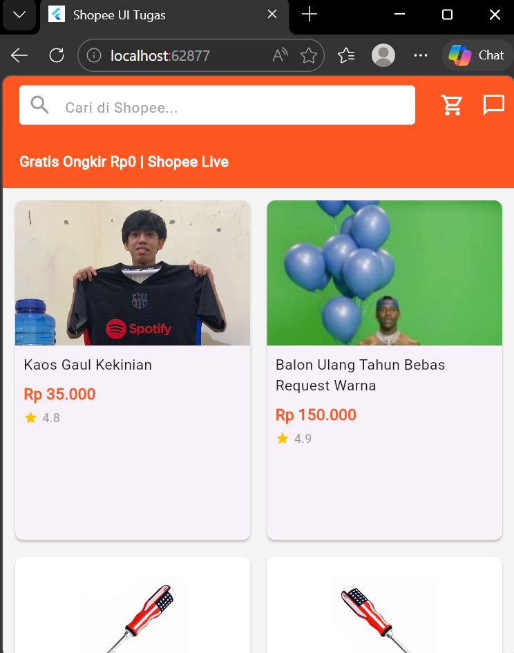
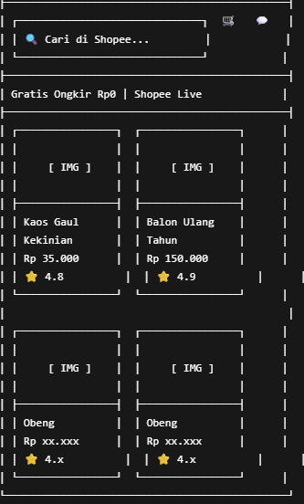

# Tugas UI/UX Flutter — [Nama Aplikasi Pilihan]

## Identitas
- **Nama:I DEWA GEDE ARYA PRAMEISA**
- **NIM:2455201110005**
- **Pilihan: C (SHOOPE) **

## Deskripsi Singkat
Project ini merupakan clone tampilan UI aplikasi Shopee menggunakan Flutter.
Halaman yang dibuat meliputi:
- Home page
- List produk
- Search bar
- Banner promo

## Widget yang Digunakan
- MaterialApp — root aplikasi Flutter
- Scaffold — struktur halaman
- AppBar — header aplikasi
- Column — menyusun widget vertikal
- Row — menyusun widget horizontal
- Container — pembungkus widget
- ListView — menampilkan daftar produk
- GridView — menampilkan produk grid
- Text — menampilkan tulisan
- Image — menampilkan gambar
- Icon — menampilkan icon

## Screenshot

## Wireframe

## Kesulitan yang Ditemui
Kesulitan yang ditemui adalah mengatur layout agar mirip dengan tampilan Shopee asli, terutama pada bagian GridView dan responsive layout. Solusinya adalah menggunakan kombinasi Expanded, Flexible, dan padding yang sesuai.